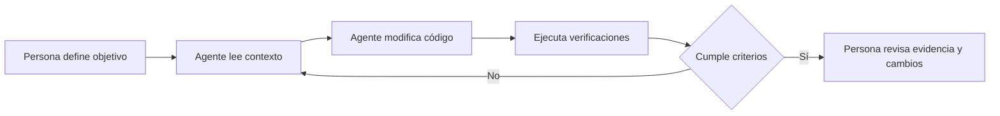

# Harness Engineering: aprende construyendo

Tutorial práctico en español · Python 3.11 o superior · Sin API keys · Nivel inicial/intermedio

**Objetivo:** aprender a preparar un proyecto para que un agente de programación pueda trabajar con instrucciones claras, herramientas reproducibles y resultados comprobables.

Construiremos alrededor de un pequeño validador de episodios de YouTube. El código inicial ya funciona; tu trabajo será observarlo, romperlo de forma controlada y mejorar el entorno que ayuda al agente a corregirlo.

## 1. Qué significa Harness Engineering

En el contexto de agentes de programación, es diseñar el entorno que permite al agente entender una tarea, actuar y recibir evidencia sobre el resultado. El modelo es una pieza; también importan el contexto, las herramientas disponibles, las restricciones y la retroalimentación.

El artículo de [OpenAI sobre Harness Engineering](https://openai.com/index/harness-engineering/) describe prácticas como mantener conocimiento en el repositorio, usar instrucciones breves que apunten a documentación y comprobar reglas automáticamente. Este laboratorio es una propuesta educativa propia inspirada en esos principios; no reproduce su infraestructura ni sus resultados.

| Concepto | Pregunta que resuelve | Ejemplo del laboratorio |
|---|---|---|
| Prompt | ¿Qué tarea debe hacer el agente? | Agregar validación de etiquetas |
| Contexto | ¿Qué necesita saber? | Contrato y estructura del proyecto |
| Harness | ¿Cómo trabaja y cómo comprueba el resultado? | Instrucciones, comandos, pruebas y CI |
| Evaluación | ¿Qué evidencia muestra que cumple? | Casos válidos e inválidos con resultados esperados |

Una prueba en verde aporta evidencia limitada a lo que comprueba. No demuestra que un agente sea confiable para cualquier tarea.



## 2. Preparación y primera ejecución · 15 minutos

Necesitas Python 3.11+, un editor y, para publicar, Git y una cuenta de GitHub. Un asistente de programación es opcional para las primeras prácticas. No hay dependencias externas.

Abre una terminal **en esta carpeta** y ejecuta:

```powershell
python --version
python -m unittest discover -s tests -v
python validator.py examples/episodio.json
```

En Windows, si `python` no está disponible pero tienes Python instalado, prueba `py -3` en su lugar. En macOS/Linux puede llamarse `python3`.

Resultado esperado: once pruebas correctas y un JSON con `"ok": true` al validar el ejemplo. El programa devuelve código de salida `0` si acepta la entrada y `1` si la rechaza.

Esta versión incluye el ejercicio de `tags` resuelto. El laboratorio comenzó con seis pruebas y ahora tiene once. En la sección 5 puedes revisar la solución existente y sus pruebas para comprender cómo se implementó el encargo.

**Antes de avanzar:** explica con tus palabras la diferencia entre imprimir «funciona» y devolver un resultado que otro programa pueda comprobar.

## 3. Explora el mapa del proyecto · 15 minutos

```text
.
├── README.md                 # Ruta de aprendizaje
├── AGENTS.md                 # Mapa e instrucciones para el agente
├── docs/contrato.md           # Comportamiento esperado
├── docs/bitacora.md           # Evidencia y reflexiones
├── validator.py              # Implementación y CLI
├── examples/episodio.json     # Entrada ficticia
├── tests/test_validator.py   # Verificaciones automáticas
└── .github/workflows/checks.yml
```

Lee primero el contrato, después las pruebas y al final la implementación. Así separas lo que el producto debe hacer de cómo lo hace actualmente.

`AGENTS.md` es un mapa para agentes que admiten ese formato. Si tu herramienta no lo carga automáticamente, pídele que lo lea. El texto orienta al agente, pero no impone permisos: los límites efectivos dependen del entorno de ejecución.

**Ejercicio:** localiza la regla del título vacío. Identifica dónde está descrita y qué prueba la comprueba. Anótalo en la bitácora.

## 4. Comprueba el circuito de retroalimentación · 20 minutos

1. Copia el ejemplo a `examples/invalido.json`.
2. Cambia el título a `"   "`.
3. Ejecuta `python validator.py examples/invalido.json`.
4. Observa `"ok": false` y el mensaje que explica el problema.
5. En PowerShell, ejecuta `$LASTEXITCODE` inmediatamente después: debe mostrar `1`.

Ahora elimina temporalmente la comprobación del título en `validate_episode` y ejecuta las pruebas. La prueba correspondiente debe fallar. Restaura la comprobación y verifica que vuelva a pasar.

**Lo que aprendes:** una regla escrita en documentación puede olvidarse; una prueba ejecutada convierte su incumplimiento en una señal visible. La calidad de esa señal depende de que la prueba represente una necesidad real.

## 5. Primera tarea con un agente · 30 minutos

Pega este encargo en tu asistente, con esta carpeta como proyecto:

```text
Lee AGENTS.md y docs/contrato.md. Agrega soporte para el campo opcional tags.
Si está presente, debe ser una lista de hasta cinco textos no vacíos después
de quitar espacios en los extremos. Una lista vacía es válida.
No modifiques los datos de entrada. Conserva la compatibilidad de episodios
que no incluyan tags y el formato de salida de la CLI.
Actualiza el contrato y agrega pruebas para los límites 0, 5 y 6, tipo inválido
y etiqueta vacía. Ejecuta las pruebas. Resume cambios, resultados y límites.
No publiques ni hagas commit: quiero revisar el diff y aprender primero.
```

Antes de aceptar los cambios, comprueba:

- ¿Un episodio sin `tags` sigue siendo válido?
- ¿Seis etiquetas producen un error?
- ¿`tags: "IA"` se rechaza aunque sea texto?
- ¿El agente probó los casos pedidos o solo afirmó que funcionan?
- ¿El contrato describe el nuevo comportamiento?

**Pregunta de aprendizaje:** ¿qué ambigüedad queda sobre etiquetas repetidas? Decide si se permiten y registra tu decisión antes de pedir otro cambio.

## 6. Convierte un fallo en una mejora permanente · 25 minutos

Elige una nueva necesidad: por ejemplo, rechazar títulos que contengan saltos de línea. Esa regla no existe en el contrato inicial; no la trates como un fallo previo.

1. Describe el caso y acuerda el resultado esperado.
2. Añade una prueba con `"Primera línea\nSegunda línea"`.
3. Ejecuta las pruebas: la nueva debe fallar y las anteriores deben pasar.
4. Implementa la regla, por tu cuenta o con el agente.
5. Ejecuta de nuevo todas las pruebas.
6. Actualiza el contrato y anota el caso en la bitácora.

Este ciclo permite distinguir una corrección comprobada de una modificación que solo parece razonable. Si el agente se equivoca repetidamente, investiga si falta información, una herramienta o un criterio verificable.

## 7. GitHub y verificación automática · 20 minutos

Publica **solo esta carpeta** como repositorio independiente. Los comandos siguientes se ejecutan desde ella. No subas la carpeta padre del proyecto de producción, que contiene credenciales y archivos ajenos al tutorial.

Crea un repositorio vacío en GitHub, sin README inicial. Después ejecuta:

```powershell
git init
git add README.md AGENTS.md validator.py docs examples tests .github .gitignore
git diff --cached --stat
git diff --cached
git commit -m "Agregar laboratorio de Harness Engineering en español"
git branch -M main
git remote add origin https://github.com/TU_USUARIO/harness-engineering-tutorial.git
git push -u origin main
```

Sustituye `TU_USUARIO` por tu cuenta. La autenticación depende de tu configuración de Git. Revisa los archivos preparados antes del commit. Si trabajas en un repositorio ya existente, no repitas la inicialización ni reemplaces su remoto.

El archivo `.github/workflows/checks.yml` ejecuta las mismas pruebas en GitHub Actions cuando se envían cambios o se abre un pull request, siempre que Actions esté habilitado. **La configuración de CI por sí sola no impide fusionar cambios:** para exigir que pase debes configurar una regla de protección o ruleset en GitHub según las opciones disponibles en tu repositorio.

Para tu siguiente ejercicio:

```powershell
git switch -c ejercicio/validar-etiquetas
# Realiza el ejercicio, ejecuta las pruebas y revisa los cambios.
git add validator.py tests/test_validator.py docs/contrato.md docs/bitacora.md
git commit -m "Validar etiquetas opcionales"
git push -u origin ejercicio/validar-etiquetas
```

Abre un pull request desde esa rama a `main`. Explica qué comportamiento cambió y pega los resultados reales de las verificaciones. Inspecciona también la pestaña Actions.

## 8. Evalúa lo aprendido

Las pruebas de este repositorio evalúan el **validador**. Para evaluar al **agente**, necesitas observar tareas completas y su proceso, además del resultado final.

Haz dos intentos del mismo ejercicio desde copias idénticas de la versión inicial: uno con un encargo breve y otro con el encargo y el contrato explícitos. Mantén la misma herramienta y configuración. Registra:

| Medida | Intento A | Intento B |
|---|---|---|
| Criterios cumplidos / criterios pedidos | | |
| Intervenciones humanas necesarias | | |
| Pruebas realmente ejecutadas | | |
| Cambios fuera del alcance | | |
| Tiempo aproximado | | |

Dos intentos sirven para aprender a observar; no bastan para demostrar una mejora general. No confundas cantidad de código con calidad.

## 9. Proyecto final

Agrega un campo opcional `duration_seconds`: entero entre 1 y 600, incluidos ambos extremos. Debe rechazar booleanos aunque Python considere `bool` una subclase de `int`.

Entrega contrato actualizado, pruebas de frontera, implementación, salida de pruebas y una entrada de bitácora. Explica qué limita el entorno y qué depende solo de instrucciones.

Has completado el tutorial cuando puedes describir una necesidad, convertirla en un criterio comprobable, guiar al agente y revisar la evidencia sin depender de que te diga «ya está».

## Alcance y fuentes

Este es un laboratorio de preparación de repositorios para agentes de programación. No implementa un runtime de agente, llamadas a modelos, memoria persistente ni aislamiento de herramientas. Tampoco publica videos: las reglas de los episodios son didácticas, no requisitos oficiales de YouTube.

- Contexto conceptual: [Harness Engineering, OpenAI](https://openai.com/index/harness-engineering/), 11 de febrero de 2026.
- Referencia técnica: [unittest, documentación de Python](https://docs.python.org/3/library/unittest.html).
- Referencia de CI: [crear y probar Python en GitHub Actions](https://docs.github.com/en/actions/use-cases-and-examples/building-and-testing/building-and-testing-python).

El código y los ejercicios de este tutorial son ejemplos originales de aprendizaje.
